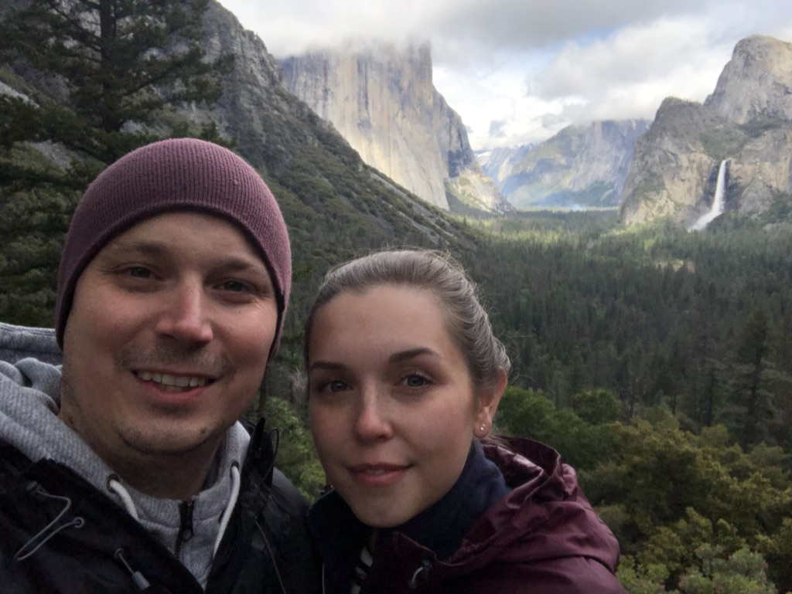
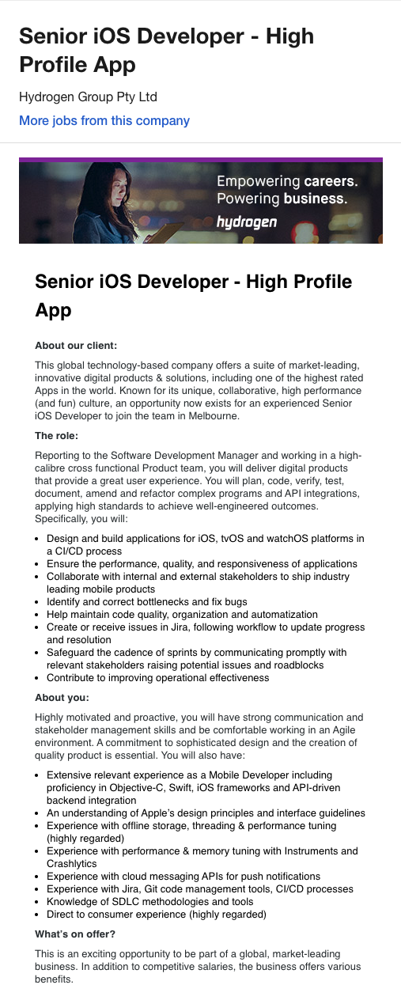
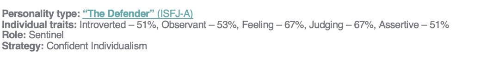
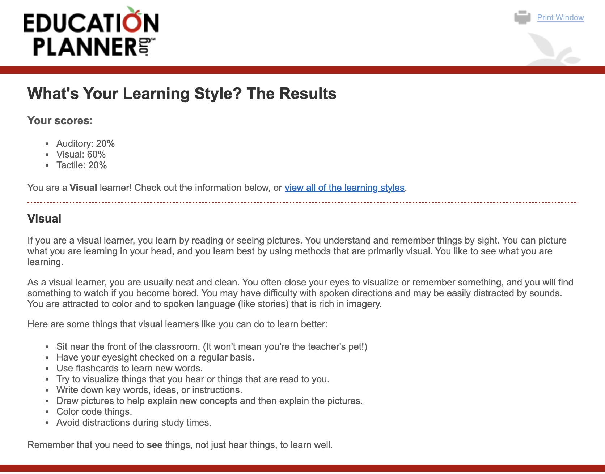
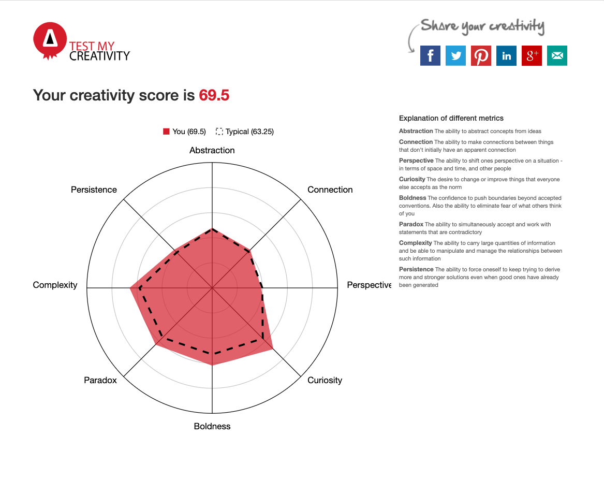

<!DOCTYPE html>
<html>
<head>

</head>
<body>
<h1>INTRODUCTION TO INFORMATION TECHNOLOGY
COSC2196 Assignment 1: My Profile</h1>

<b>Name:</b> Adam Hedt

<b>Student Number:</b> s3075523

<b>Email:</b>s3075523@student.rmit.edu.au

<b>Background:</b>
 

I’m Australian and was born in Melbourne I have studied previously with RMIT.
English is my only spoken language. My hobbies are building pc’s, keeping marine fish and coral, camping and spearfishing.

<h2>INTERESTS in IT</h2>

What interests me about IT is the ever-evolving technological advances across all spectrums of the field.
  Whether it’s in the medical field with exome sequencing and the cost reduction over the last 20 years from millions of dollars to now under a thousand for a single genome sequence.
  Or the evolution of mobile phones my first one in 1998 that was a Nokia 5110, it could make calls, play one game snake and had a monochrome screen, to now an Apple iPhone 11 that is in its own
  right a mini modern computer that can make colour video calls to the other side of the world, play an extensive library of songs through an internet connection from a server in another country.

My interest in IT started at a young age probably around 4-5 playing on handheld Nintendo watch gaming devices. When I was about 8 my father bought my first computer a 386 I had to use dos commands
to run programs and games. Throughout my school years I’ve used different software applications photoshop, CAD, Office etc. I have built quite a few PC’s over the years for myself, family and friends,
this has been useful with problem solving with components that were either faulty or not setup right.

Over the last year or so I have been learning to program using Xcode with the Swift language
and Eclipse/Android Studio with the Java language. I have also installed and built a large home network at home with ip cameras, gigabyte network switches, wireless access points to cover the entire block and some home automation.
I also love gaming and game on nearly every platform PC/PlayStation/Xbox/Nintendo/mobile when I have the time.
PC and PlayStation are my preferred platforms to game on as all my friends use them and they seem to have the best content that I enjoy.

I am taking this course through RMIT to one day change careers; IT really excites me as it has so many different avenues to explore. One day I like to run a team of people working on large projects within the IT field.
Developing apps that will improve people’s everyday lives would be another thing I would like to achieve.

During my studies I would like to learn how to become a proficient programmer and gain knowledge on how to code in other languages.
Networking and Cloud computing are other areas of the IT field that I would like to gain knowledge on and be able to fully understand.

<h2>IDEAL JOB: IOS MOBILE DEVELOPER</h2>

<a href="https://www.seek.com.au/job/40549192?type=standard#searchRequestToken=b88b9b9d-d0f1-4d8b-82dc-ba34559cfb81" target="_blank">clink link to see job profile on Seek</a>

The job position is that of a mobile developer who will work with client’s digital products to produce applications for them through the iOS, tvOS and watchOS platforms of Apple whilst continually updating and improving them.
This will include planning the application, coding, testing, documenting and using API integration and refactor complex program integration within the app. There will be ongoing work with maintaining the code with fixing performance
issues and bug fixes, as well as optimising the quality and automatization of the code. Using Jira for following workflow of a project, reviewing your work and others involved within projects.

This position appeals to me as it would be something, I would like to end up doing as a career, working with teams in developing applications that will benefit others in their everyday lives.
I enjoy programming as I find it challenging with debugging code when it won’t compile, I also enjoy working within teams. I also like using Xcode with the GUI interface, it has so many great features that are easy to use.
Working with API’s requesting and retrieving data to implement within the code also interests me as I find it a challenge but also quite satisfying when it all works.

With the skills and qualifications and experience for the position, the employer is asking that the applicant must be a well experienced professional mobile developer who is confident in Objective C, iOS frameworks and API backend integration.
They also need to understand the Apples design principles and interface guidelines of Xcode UI. Experience with offline storage, threading and performance tuning of apps as well as memory optimisation so the apps are running proficiently
and don’t cause excessive memory usage. A well-focused individual showing attention to detail and the ability to analyse and implement. Experience in cloud messaging API’s for push notifications to the application devices. Experience with Jira,
Git code and management tools for the validation of code through repositories. Be able to use a SDLC planning approach to projects and contributions to improving the operational effectiveness of the projects.

I have worked in a team environment over the past 17 years.
I have run projects on my own and work within a group, consulting with other group participants on the progress, problem-solving and final outcome of projects.
2 years’ experience using and developing applications with Swift and Xcode.
Using API integration within the applications.
I am proficient in Word, Excel and PowerPoint as well as windows/OS operating systems.
I have successfully completed the iOS App Development with Swift course through RMIT.

I plan of obtaining a Bachelor of Information Technology, through this degree I will gain better experience within the programming field in different coding languages to be more competent programmer.
Also, a deeper understating of computer, network and cloud design that I can utilise within application development. Also gaining experience in repository tools like Git and Jira will help me obtain a position like this.

<h2>PERSONAL PROFILE</H2>

<h3>Myers-Briggs test
Results:</h3>

<ul>
  <li><b>What do the results of the test mean for you?</b></li>
  
The results from the Myers-Briggs test show that my strengths are that I am reliable and supportive, enthusiastic and observant hard working and practical. My weaknesses are that I’m shy, take things too personally,
    hold my feelings back, overload myself with work and reluctant to change. I would say that this is quite accurate with how I portray myself in everyday life.

  <li><b>How do you think these results may influence your behaviour in a team?</b></li>
  
With the results influencing how I behave in a team, showing that I am willing to be supportive and get on with team orientated tasks.

  <li><b>How should you take this into account when forming a team?</b></li>
  I would be enthusiastic in forming ideas and being observant to the other team members opinions and suggestions within the project. But with holding my feelings back on ideas I do this often, so maybe I should just
  get my ideas or opinions out into the open so others can give their views on what I’m thinking.

</ul>

<h3>Online learning test
Results:</h3>

<ul>
  <li><b>What do the results of the test mean for you?</b></li>
  
These results from the learning style test mean to me that I’m a visual learner, taking a learning approach more to reading and visually seeing things than just talking about them.

  <li><b>How do you think these results may influence your behaviour in a team?</b></li>
  
With these results I’d say it would influence myself to have more conference meeting within a team either in a board meeting or over a video conference call where topics are discussed with visual aids.

  <li><b>How should you take this into account when forming a team?</b></li>
  
When forming a team, I think that using applications for communication like video conferences or where you can discuss ideas and post images along with text would work best in a team environment for me.

</ul>

<h3>Creativity Test
Results:</h3>

<ul>
  <li><b>What do the results of the test mean for you?</b></li>
  
 With the Creativity test is how I was more on the curiosity and complexity side of creativity. I think it shows I strive for perfection with what I’m working on or with. Also it shows that I work well managing information and tasks.

  <li><b>How do you think these results may influence your behaviour in a team?</b></li>
  
I think with these results that I would be happy to take on tasks and use the information provided in discussions to manage what needs to be done to complete the tasks set out by the team.

  <li><b>How should you take this into account when forming a team?</b></li>
  
When forming a team, I would be good at taking on ideas and implementing them into areas of a project.

</ul>

<h2>Project Idea</h2>

<h3>Overview</h3>

My project idea would be developing an application for an iOS mobile device and later implementing it for Android. The app would be about fitness and wellness, it could be integrated with a smart watch that tracks the users heart rate, daily steps taken, sleep cycle and eating habits to provide the user with an outlook on their overall health. The user could also set targets and goals that the app could compare daily and weekly results.

<h3>Motivation</h3>

The motivation for the project idea is that I usually only see fitness apps that show workout times, distance travelled, and kilojoules burned. An app that takes a person’s everyday health and lifestyle attributes could help users become healthier individuals.

<h3>Description</h3>

The app will be built initially to be used with the Apple iOS and watchOS devices.
The user for the first time will be asked to input their age, gender, height and weight, this will calculate a BMI score. The app will use this data later for comparisons with a health reference guide.
Its main features would be:

<ul>
  <li>heart rate monitor that logs the users heart rate in real time and the app would take this information and either display it in real time, hourly, daily or weekly charts to the user for viewing. These results can be cross compared with others and be downloadable into a pdf file that could be used by medical professionals as well.</li>
  <li>Sleep cycle monitor that records the individuals sleep patterns when activated by the user either on the iOS device or through the watch. It would use the sensors in the phone when placed onto the bed or the watch and record and disturbances or waking of the user as well as audio for snoring or sleep talking. Users will be given tips on what is the best time for them to go to sleep and how many hours they should be getting so they feel rested and refreshed upon waking up through data previously recorded. The sleep cycle will also use an alarm for the user with features like do not disturb turning off all notification alerts whilst sleeping.</li>
  <li>Step Counter will use the gps and sensors of the phone or watch to count and record all different types of work outs. The user will be able to set daily or weekly goals to strive for and be able to compare or send challenges to other users.</li>
  <li>Eating habits/wellness this feature the user can record all daily meals into the app, these can then be referenced and viewed as a daily, weekly or monthly reference on the users eating habits. Meals can be categorised in into different fields, something like a traffic light system that if a meal is in the healthy range it will be given a green icon next to its description, a moderately healthy meal will be given an orange icon and an unhealthy meal will use a red icon.

    
There will be a library of food that has already been categorised by the development team so the user will be able to select the meal type and the time when the meal was consumed at breakfast, lunch or dinner as well as a snack option for anytime between. All meals will be recorded and referenced for better meal planning by the app or user. Also integrated by the phones gps could be a push notification that if the app detects that the user has been in a location for more than 10 minutes, the app will check location through google maps API and if the gps coordinates are a restaurant, café or fast food venue. The app will notify the user if they would like to register what they are eating or going to eat.
</li>
  <li>With all the different aspects of the app the user will have calendar that will display all recorded results so they can view their general wellbeing and health. This can be also compared to other users who are in the same age and gender categories.</li>
  <li>The app will also give the user suggestions of what they could do each day to lead a healthier lifestyle. Whether it is completing 3000 steps for the day and activating that target for the user. Or suggesting the user gets at least 8 hours of uninterrupted sleep, as last night they slept poorly with only 5 hours of interrupted sleep. Through the app data it could also see that the user had 3 bad red icon meals yesterday and maybe they should try having some green light meals today to feel better.</li>
</ul>

The layout of the GUI should be simple and easy to navigate with not too much clutter and unnecessary information displayed to the user.

<h3>Tools and Technologies</h3>

Apple computers would be needed with macOS for the development of the application.
The software used to create the app would be Xcode and Swift language for the programming of the code. The required devices would be Apple iOS phones and watchOS for verification and testing. GitHub would be used for the management of the code between the team members. Slack would be used for communication between the team members and Zoom for video conferencing.

<h3>Skills Required</h3>

The required skills needed for the project:
Planning and organisation skills of the project development, with competency in macOS and apple devices for testing and development. Experience with Xcode GUI design and implementation, an eye for keeping the designs simple and easy to use but visually attractive and appealing. Experience in coding with Swift and app implementation of iOS and watchOS devices. Apple macs will be needed for the development of the app and IOS and watchOS devices for the testing stages. Experience with using git repositories would be needed as well.

The software Xcode is free to download from the App store and hardware most developers have access to a mac. Finding the skills for the project might be difficult as finding people with Xcode and swift experience with a good understating of API integration could prove to be a problem. Also finding people with the right hardware decent running Apple mac computers and apple phones and watches.

<h3>Outcome</h3>

 If the project was successful and all the implementations of the app work well, this app could become a leading application for health and wellbeing. Anyone who uses a smart phone could improve their health by downloading and using the app to its full potential.
By combining all these health areas into one manageable application it could solve users having to use multiple apps for each individual field.

</body>
</html>
